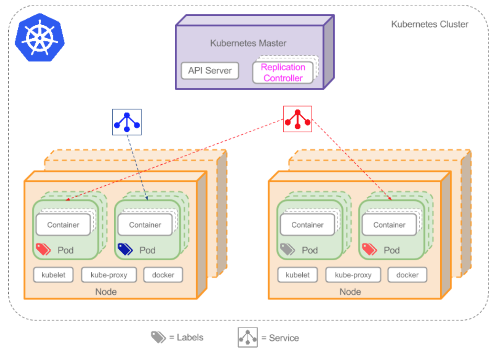

# Kubernetes

### 创建应用的调度流程：
    kubectl提交一个请求，来创建RC，此时Controller Manager通过API server里的接口监听到这个RC事件，分析之后，发现当前集群中还没有它对应的Pod实例，于是根据RC里的Pod模板定义 个Pod对象；接下来，此事件被Scheduler发现，它立即执行一个复杂的调度流程，为这个新Pod选定一个落户的Node，这个过程可称为绑定；随后模板Node上运行的Kubelet进程通过API Server监测到这个“新生的”Pod并按照它的定义，启动Pod并负责后期的管理；随后我们通过Kubectl提交一个映射到该Pod的Server的创建请求，Controller Manager会通过Label标签查询到相关联的Pod实例，然后生成Service的Endpoints信息；接下来，所有Node上运行的Proxy进程通过API Server查询并监听Service对象及其对应的Endpoints信息，建立一个负载均衡器来实现Service访问到后端Pod的流量转发功能；
